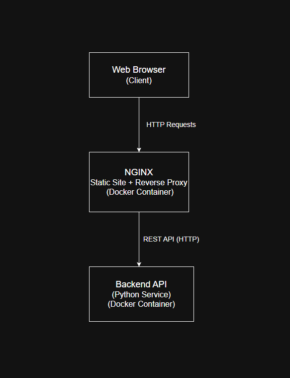
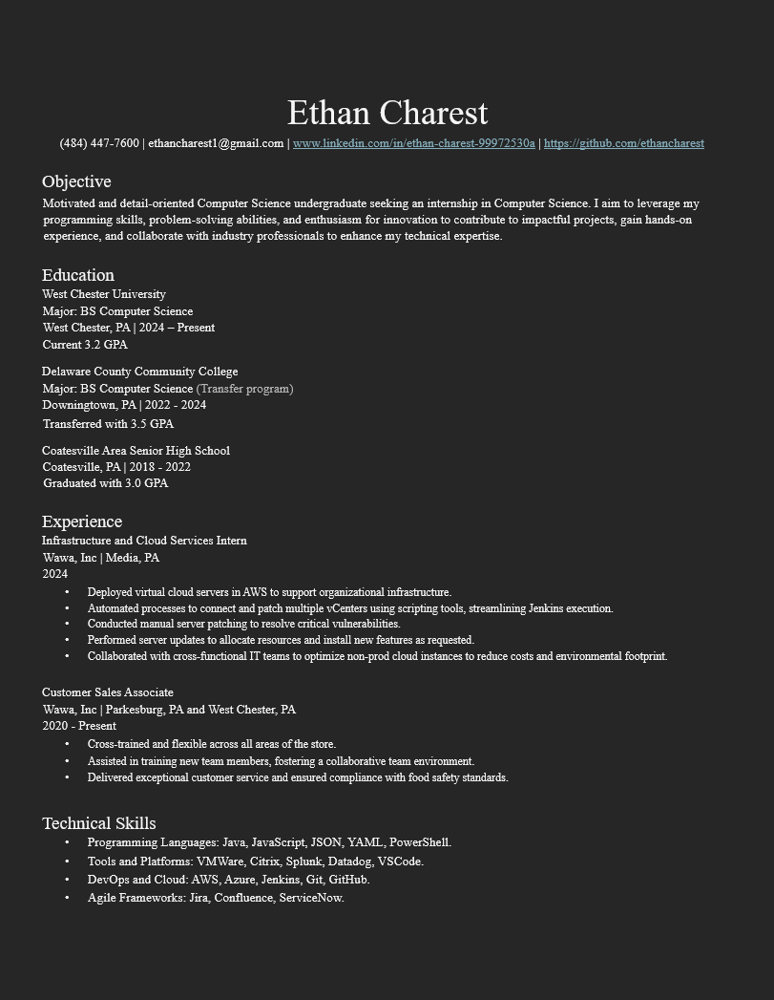

# CSC468-project

# Static Site + API Project

This project is a containerized web application that demonstrates a simple but realistic frontend–backend architecture using Docker. The system consists of two components: a static website served by Nginx and a backend API service. The frontend communicates with the backend using HTTP requests, with Nginx acting as a reverse proxy.

The purpose of this project is to explore container orchestration, service isolation, and inter-container communication while building a foundation that can be incrementally extended throughout the semester.

## System Architecture
------------------------------

Component Overview:

Frontend (Nginx): Serves static HTML, CSS, and JavaScript content to the user.

Backend API: Provides JSON responses to frontend requests.

Communication: The frontend sends REST API requests that are routed by Nginx to the backend container over Docker’s internal network.

## Proposal
------------------------------

This project will be implemented using Docker and Docker Compose to manage multiple containers and their networking.

### Planned base images:
------------------------------

Frontend: nginx:alpine  
Chosen for its lightweight footprint and suitability for serving static files and acting as a reverse proxy.

Backend API: python:3.x-slim  
Chosen to implement a simple REST API using a lightweight Python web framework such as Flask or FastAPI.

### Design considerations:
------------------------------

Each service will run in its own container to maintain separation of concerns.

Nginx will be configured as a reverse proxy to route API requests to the backend service.

Docker Compose will manage service startup, networking, and configuration.

The project structure allows for future enhancements such as databases, caching, authentication, and monitoring.

## Resume
------------------------------

## Professional Resume

