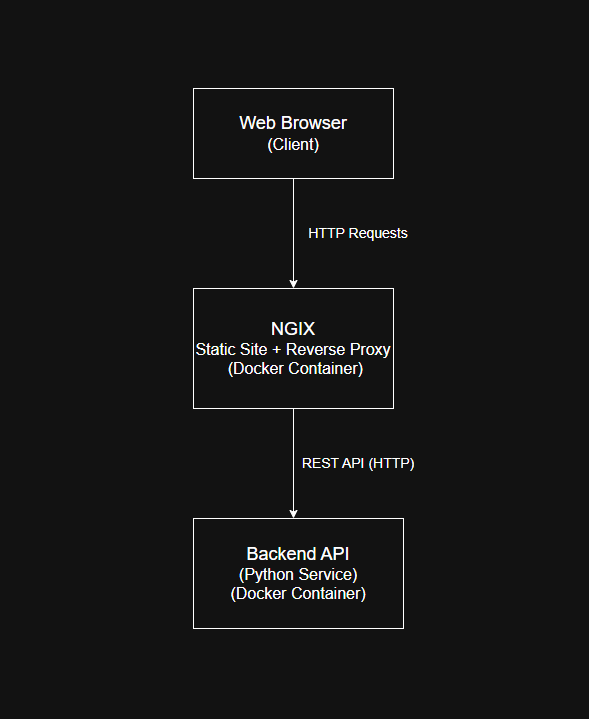

# CSC468 Project

A containerized web app with a static frontend served by Nginx and a Flask backend API. The two talk to each other over Docker's internal network, with Nginx acting as a reverse proxy.

Built to get hands-on with Docker, container networking, and cloud infrastructure.

## How it works



- **Frontend (Nginx):** Serves the static HTML, CSS, and JS. Also acts as a reverse proxy — any request to `/api/` gets forwarded to the backend.
- **Backend (Flask):** A simple Python API running on port 5000. Not exposed to the outside world — only reachable through Nginx.
- **Networking:** Both containers live on the same Docker bridge network (`app-network`) so they can talk to each other by service name.

## Tech Stack

| Layer | Technology | Why |
|-------|-----------|-----|
| Frontend server | Nginx (alpine) | Lightweight, good for static files and proxying |
| Backend API | Python 3.11 + Flask | Simple and easy to work with for a project this size |
| Orchestration | Docker Compose | Handles networking, startup order, and service config |
| Infrastructure | CloudLab (XenVM) | Provisioned via `profile.py` using the GENI RSpec API |

## Project Structure

```
CSC468-project/
├── profile.py              # CloudLab infrastructure profile
├── docker-compose.yml      # Service orchestration
├── frontend/
│   ├── Dockerfile
│   ├── nginx.conf          # Reverse proxy config
│   └── static/
│       ├── index.html
│       ├── style.css
│       └── app.js
└── backend/
    ├── Dockerfile
    ├── requirements.txt
    └── app.py              # Flask API
```

## API Endpoints

| Endpoint | Method | Returns |
|----------|--------|---------|
| `/api/health` | GET | Backend status |
| `/api/data` | GET | Project info and stack |

## Running it locally

You'll need Docker Desktop installed.

```bash
git clone https://github.com/ethancharest/CSC468-project.git
cd CSC468-project
docker compose up --build
```

Open `http://localhost` in your browser. To stop:

```bash
docker compose down
```

## Running on CloudLab

1. Log into [CloudLab](https://cloudlab.us)
2. Create a new experiment using `profile.py`
3. Wait for the VM to boot — Docker and the containers start automatically
4. Open `http://<node-public-ip>` in your browser

## Resume


