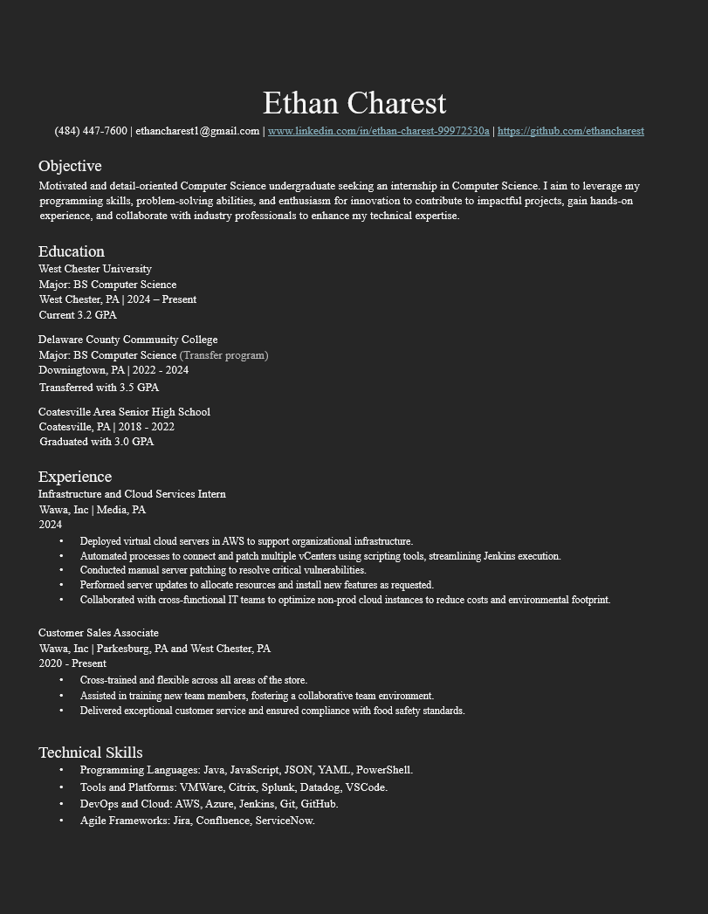

# CSC468 Project

A containerized web app with a static frontend served by Nginx and a Flask backend API. The two talk to each other over Docker's internal network, with Nginx acting as a reverse proxy.

Built to get hands-on with Docker, container networking, and cloud infrastructure.

## How it works



- **Frontend (Nginx):** Serves the static HTML, CSS, and JS. Also acts as a reverse proxy — any request to `/api/` gets forwarded to the backend.
- **Backend (Flask):** A simple Python API running on port 5000. Not exposed to the outside world — only reachable through Nginx.
- **Networking:** Both containers live on the same Docker bridge network (`app-network`) so they can talk to each other by service name.

## Tech Stack

| Layer | Technology | Why |
|-------|-----------|-----|
| Frontend server | Nginx (alpine) | Lightweight, good for static files and proxying |
| Backend API | Python 3.11 + Flask | Simple and easy to work with for a project this size |
| Orchestration | Docker Compose | Handles networking, startup order, and service config |
| Infrastructure | CloudLab (XenVM) | Provisioned via `profile.py` using the GENI RSpec API |

## Project Structure

```
CSC468-project/
├── profile.py              # CloudLab infrastructure profile
├── docker-compose.yml      # Service orchestration
├── frontend/
│   ├── Dockerfile
│   ├── nginx.conf          # Reverse proxy config
│   └── static/
│       ├── index.html
│       ├── style.css
│       └── app.js
└── backend/
    ├── Dockerfile
    ├── requirements.txt
    └── app.py              # Flask API
```

## API Endpoints

| Endpoint | Method | Returns |
|----------|--------|---------|
| `/api/health` | GET | Backend status |
| `/api/data` | GET | Project info and stack |

## Running it locally

You'll need Docker Desktop installed.

```bash
git clone https://github.com/ethancharest/CSC468-project.git
cd CSC468-project
docker compose up --build
```

Open `http://localhost` in your browser. To stop:

```bash
docker compose down
```

## Running on CloudLab

1. Log into [CloudLab](https://cloudlab.us)
2. Create a new experiment using `profile.py`
3. Wait for the VM to boot — Docker and the containers start automatically
4. Open `http://<node-public-ip>` in your browser

## Build Process
 
Both services have their own `Dockerfile`.
 
**Backend (`backend/Dockerfile`)**
 
```dockerfile
FROM python:3.11-slim
```
`python:3.11-slim` is the official lightweight Python image. Chosen because it's significantly smaller than `python:3.11-slim` and builds faster.
 
```dockerfile
WORKDIR /app
```
Sets the working directory inside the container to `/app`. All subsequent commands run from here.
 
```dockerfile
COPY requirements.txt .
RUN pip install --no-cache-dir -r requirements.txt
```
Copies `requirements.txt` first and installs dependencies before copying the rest of the code. This skips the pip install on rebuilds and saves time.
 
```dockerfile
RUN apt-get update && apt-get install -y curl && rm -rf /var/lib/apt/lists/*
```
Installs `curl` so Docker can run the healthcheck against `/api/health` to know when Flask is ready before starting Nginx.
 
```dockerfile
COPY . .
EXPOSE 5000
ENV FLASK_APP=app.py
CMD ["python", "app.py"]
```
Copies the rest of the code in, exposes port 5000 internally, tells Flask which file is the app entry point, and starts it.
 
---
 
**Frontend (`frontend/Dockerfile`)**
 
```dockerfile
FROM nginx:alpine
```
`nginx:alpine` is the official lightweight Nginx image which is fine for serving static files and proxying.
 
```dockerfile
RUN rm /etc/nginx/conf.d/default.conf
COPY nginx.conf /etc/nginx/conf.d/
```
Removes Nginx's default config and adds custom config.
 
```dockerfile
COPY static/ /usr/share/nginx/html/
```
Copies the static files into the directory Nginx serves from by default.
 
## Networking
 
Both containers are on a Docker bridge network called `app-network`. Docker automatically handles DNS resolution by container name, so `nginx.conf` can reference the backend directly:
 
```nginx
proxy_pass http://backend:5000;
```
 
The backend uses `expose` instead of `ports` so port 5000 is only accessible to other containers on the network. The only entry point from outside is Nginx on port 80.


## Resume




